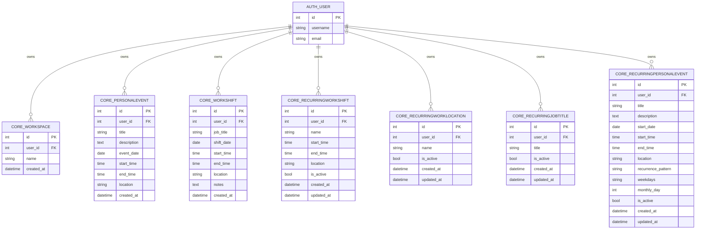

# StudyStream Database ERD

Generated from the current live SQLite schema in `db.sqlite3` on 2026-03-24.

## Scope

This ERD focuses on app-domain tables plus the key Django auth table used for ownership.

- Domain tables: `core_*`
- Owner table: `auth_user`

## Mermaid ER Diagram

## Table Inventory (Current)

### Domain tables

1. `core_workspace`
2. `core_personalevent`
3. `core_workshift`
4. `core_recurringworkshift`
5. `core_recurringworklocation`
6. `core_recurringjobtitle`
7. `core_recurringpersonalevent`

### Framework/auth tables

1. `auth_user`
2. `auth_group`
3. `auth_group_permissions`
4. `auth_permission`
5. `auth_user_groups`
6. `auth_user_user_permissions`
7. `django_admin_log`
8. `django_content_type`
9. `django_migrations`
10. `django_session`

## Foreign Keys

- `core_workspace.user_id -> auth_user.id`
- `core_personalevent.user_id -> auth_user.id`
- `core_workshift.user_id -> auth_user.id`
- `core_recurringworkshift.user_id -> auth_user.id`
- `core_recurringworklocation.user_id -> auth_user.id`
- `core_recurringjobtitle.user_id -> auth_user.id`
- `core_recurringpersonalevent.user_id -> auth_user.id`

## Notes

- Recurring values are stored as templates (`core_recurring*`) and expanded in application logic.
- Current schema is user-scoped. Workspace-scoping can be added later with optional `workspace_id` foreign keys.
