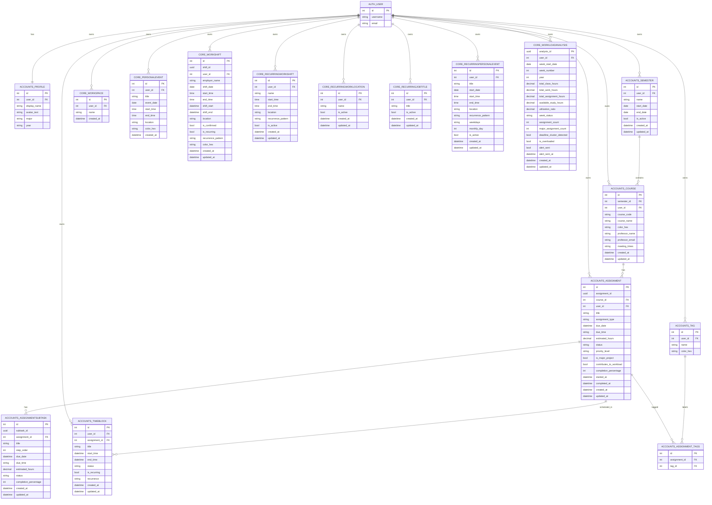

# StudyStream Database ERD

Updated from current Django model definitions on 2026-04-18.

## Scope

This ERD covers the application domain schema and ownership links to Django users.

- Accounts app tables: accounts_*
- Core app tables: core_*
- Owner/auth table: auth_user

## Mermaid ER Diagram

## Table Inventory

### Domain tables

1. accounts_profile
2. accounts_semester
3. accounts_course
4. accounts_tag
5. accounts_assignment
6. accounts_assignmentsubtask
7. accounts_timeblock
8. accounts_assignment_tags (M2M through table)
9. core_workspace
10. core_personalevent
11. core_workshift
12. core_recurringworkshift
13. core_recurringworklocation
14. core_recurringjobtitle
15. core_recurringpersonalevent
16. core_workloadanalysis

### Framework/auth tables

1. auth_user
2. auth_group
3. auth_group_permissions
4. auth_permission
5. auth_user_groups
6. auth_user_user_permissions
7. django_admin_log
8. django_content_type
9. django_migrations
10. django_session

## Key Constraints and Notes

- accounts_profile uses one-to-one ownership with auth_user.
- accounts_assignment_tags supports Assignment <-> Tag many-to-many mapping.
- core_workloadanalysis enforces a unique weekly record per user via unique constraint on (user, week_start_date).
- Recurring schedules are template records in core_recurringworkshift and core_recurringpersonalevent and are expanded in application logic.
