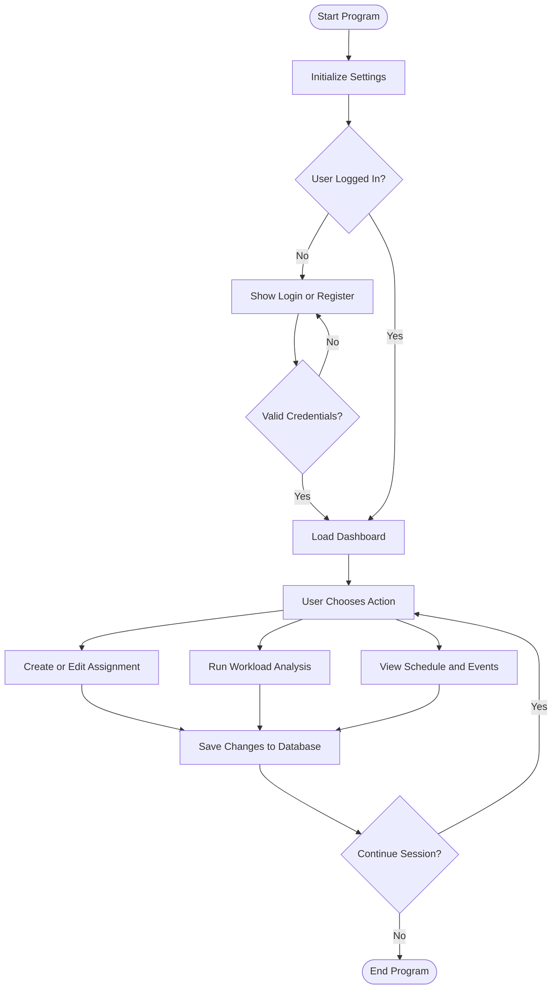

# StudyStream Program Flowchart

This diagram shows the high-level runtime flow through authentication, dashboard actions, persistence, and loop/exit behavior.

## Mermaid Flowchart

## Notes

- Decision nodes (`{...}`) represent conditional branching.
- Rounded endpoints (`([ ... ])`) mark start and end states.
- This is a high-level flow and can be expanded into app-specific sub-flows.
